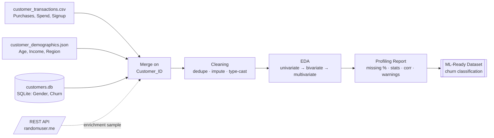
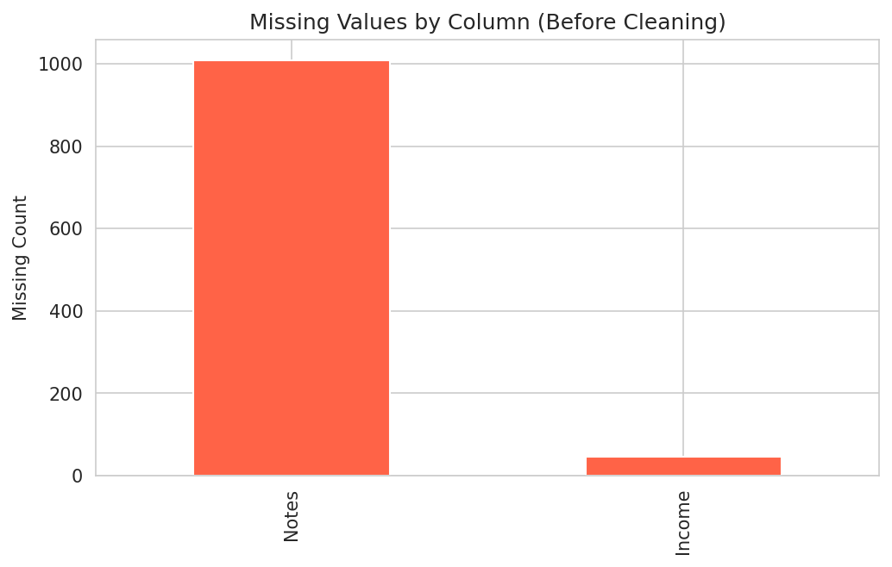
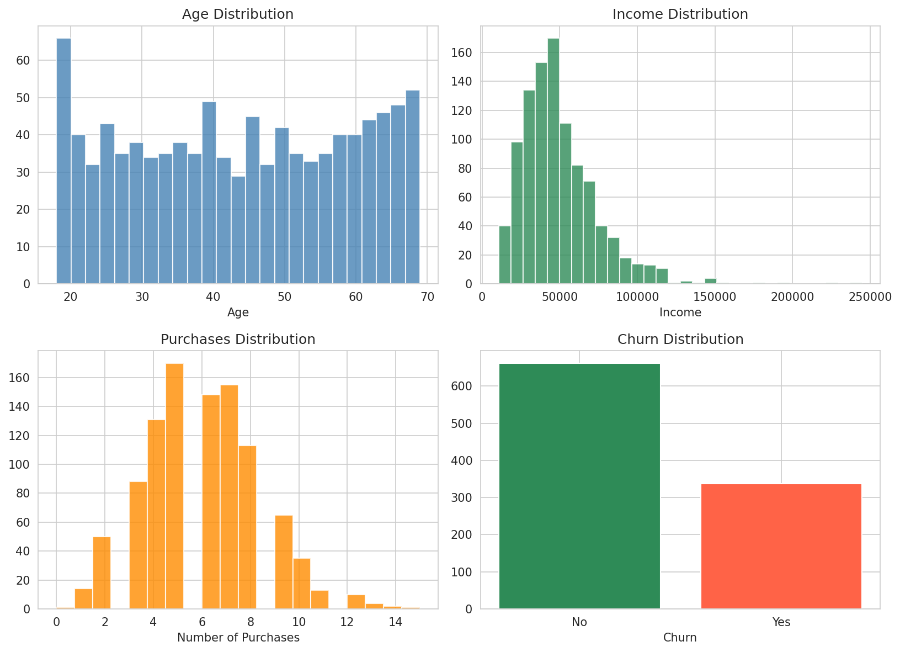
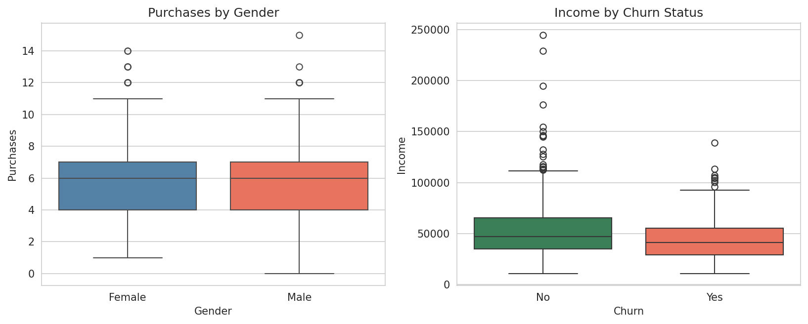
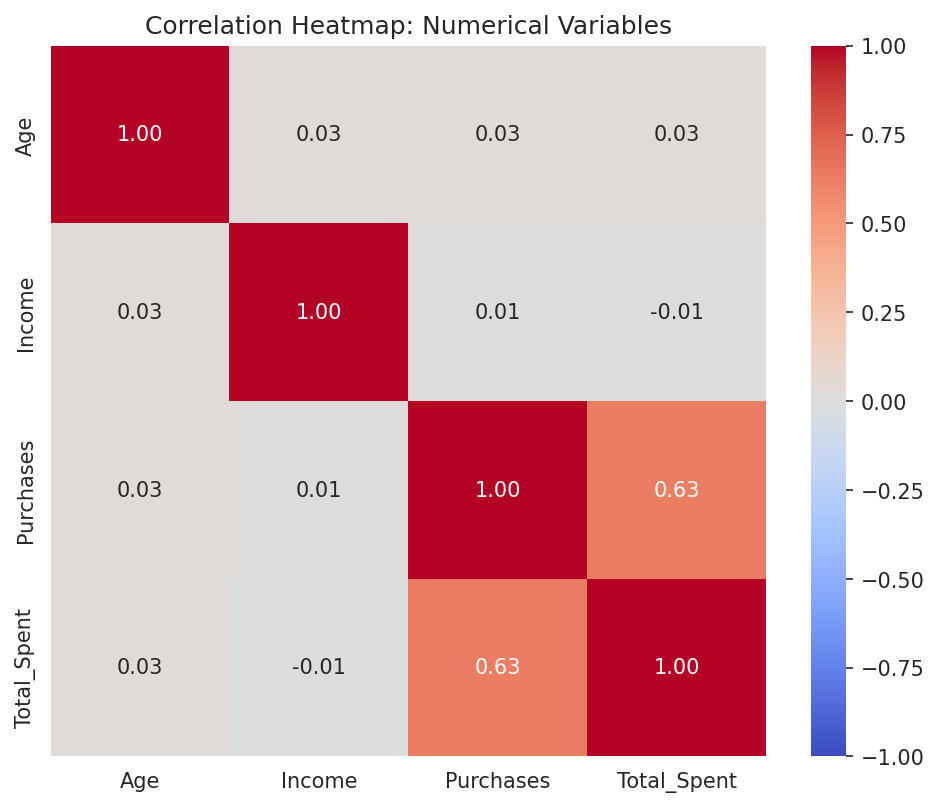
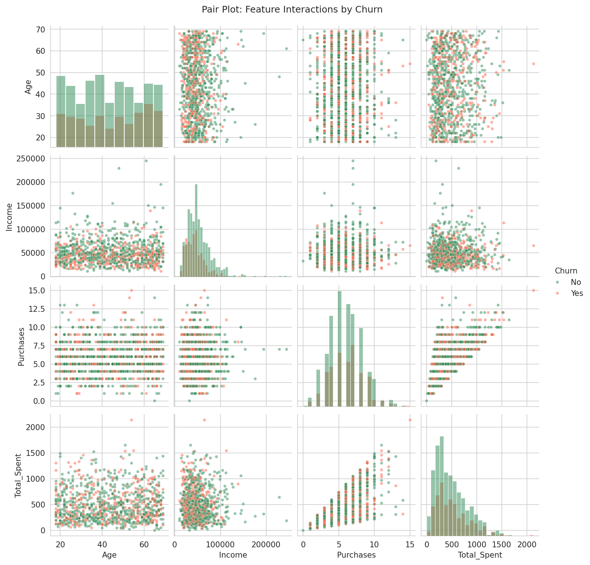
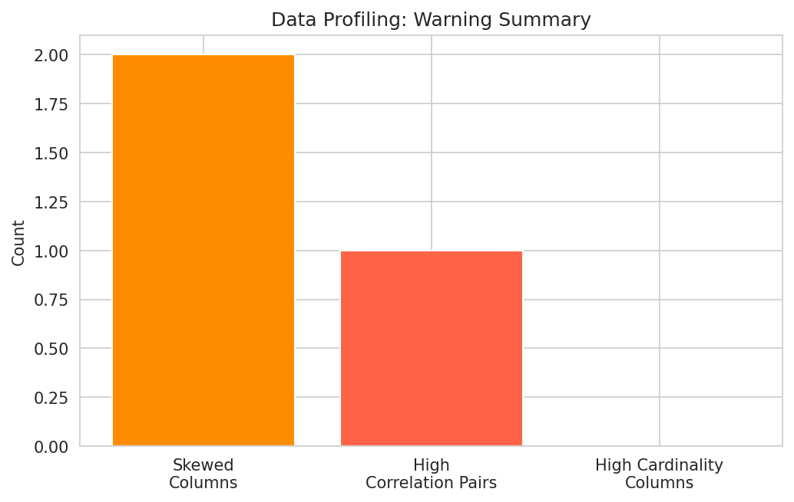

<p align="center">
  
</p>

<p align="center">
  
  
  
  
  
  
  
</p>

<p align="center">
  
  
  
  
</p>

<p align="center">
  <a href="https://github.com/Dhairyapatel1mc"></a>
  &nbsp;
  <a href="https://www.linkedin.com/in/ghost-patel-0267663b7/"></a>
  &nbsp;
  <a href="https://www.instagram.com/ghost_6927/?hl=en"></a>
</p>

<p align="center"><i>A production-style data preprocessing pipeline — not a toy, pre-cleaned CSV walkthrough.</i></p>

---

<a name="toc"></a>
## 📌 Table of Contents

- [🎯 Overview](#-overview)
- [🏗️ Pipeline Architecture](#️-pipeline-architecture)
- [🧭 Problem Framing](#-problem-framing)
- [📊 Dataset Schema](#-dataset-schema)
- [📁 Project Structure](#-project-structure)
- [🧠 Methodology](#-methodology)
- [🛠️ Key Engineering Decisions](#️-key-engineering-decisions)
- [🧰 Tech Stack & Rationale](#-tech-stack--rationale)
- [⚙️ Installation](#️-installation)
- [▶️ How to Run](#️-how-to-run)
- [📈 Visualizations](#-visualizations)
- [📄 Results](#-results)
- [🎓 Learning Outcomes](#-learning-outcomes)
- [💡 Roadmap](#-roadmap)
- [👤 Author](#-author)
- [⭐ Support](#-support)
- [🏆 Conclusion](#-conclusion)

---

## <a id="-overview"></a>🎯 Overview

**Data Profiler** is an end-to-end data preprocessing and feature engineering pipeline built on a customer dataset that is deliberately fragmented across **four independent systems** — a transactional CSV export, a demographics JSON feed, a SQL customer-status table, and a third-party REST API. This mirrors how customer data actually lives inside most organizations: no single source of truth, inconsistent formats, and quality issues that only surface once you try to join everything together.

The deliverable is a clean, profiled, ML-ready dataset framed around a concrete business objective: **predicting customer churn**.

| Stage | What it does |
|---|---|
| **Acquisition** | Ingests and reconciles 4 heterogeneous sources on a shared key |
| **Cleaning** | Resolves missing data, duplicate records, and mixed types |
| **EDA** | Uni-, bi-, and multivariate analysis to surface churn signal |
| **Profiling** | A dependency-free, rule-based data quality report |

**[⬆ Back to top](#toc)**

---

## <a id="-pipeline-architecture"></a>🏗️ Pipeline Architecture



The API branch is intentionally decoupled from the join — it demonstrates ingestion from a live external service without introducing a fabricated join key into the analytical dataset, keeping the merged data honest.

**[⬆ Back to top](#toc)**

---

## <a id="-problem-framing"></a>🧭 Problem Framing

**Business question:** Which customers are likely to churn, and what signal do we have to act on it before they leave?

**ML framing:** Binary classification — `Churn ∈ {Yes, No}` — with the four source-merged features (`Age`, `Income`, `Region`, `Purchases`, `Total_Spent`, `Gender`) as candidate predictors.

**Class balance:** ~34% positive class (churned). This is imbalanced enough that accuracy alone would be a misleading metric for any downstream model — precision/recall, F1, or ROC-AUC would be the honest choice, and a stratified train/test split is non-negotiable. This is called out explicitly here because it's the kind of thing that's easy to miss in EDA and expensive to discover after training.

**[⬆ Back to top](#toc)**

---

## <a id="-dataset-schema"></a>📊 Dataset Schema

| Column | Source | Type | Role |
|--------|--------|------|------|
| `Customer_ID` | All | string | Join key |
| `Age` | JSON | float | Feature |
| `Income` | JSON | float | Feature *(45 nulls pre-clean)* |
| `Region` | JSON | categorical | Feature |
| `Purchases` | CSV | integer | Feature |
| `Total_Spent` | CSV | float | Feature *(mixed-type pre-clean)* |
| `Signup_Date` | CSV | date | Feature (tenure candidate) |
| `Gender` | SQL | categorical | Feature |
| `Churn` | SQL | categorical | **Target** |

1,000 customer records post-merge, sourced from `customer_transactions.csv` (1,008 rows pre-dedupe), `customer_demographics.json`, and `customers.db`.

**[⬆ Back to top](#toc)**

---

## <a id="-project-structure"></a>📁 Project Structure

```
.
├── README.md
├── data_profiler.ipynb                   # Part A–E: theory → acquisition → clean → EDA → profile
├── sources/
│   ├── customer_transactions.csv         # Source 1 — CSV
│   ├── customer_demographics.json        # Source 2 — JSON
│   ├── customers.db                      # Source 3 — SQLite
│   └── cached_api_response.json          # Source 4 — REST API (offline-safe cache)
└── charts/
    ├── 01_missing_values_before_cleaning.png
    ├── 02_univariate_distributions.png
    ├── 03_bivariate_gender_income_churn.png
    ├── 04_correlation_heatmap.png
    ├── 05_pairplot_feature_interactions.png
    └── 06_profiling_warning_summary.png
```

**[⬆ Back to top](#toc)**

---

## <a id="-methodology"></a>🧠 Methodology

**1 · Acquisition** — `pd.read_csv()`, `json.load()`, and `pd.read_sql()` (via `sqlite3.connect()`) each load one source independently. A `requests.get()` call against `randomuser.me` demonstrates live API ingestion, wrapped in a try/except that falls back to a cached response — the notebook stays reproducible with or without network access. The three tabular sources are reconciled with successive `.merge(..., on='Customer_ID', how='left')` calls.

**2 · Cleaning** — Every fix is preceded by a quantified diagnosis, not applied blindly: `.isnull().sum()` and `.duplicated().sum()` establish the baseline (8 duplicate rows, 45 missing `Income` values) before `drop_duplicates()`, median imputation, and `.str.replace()` + `.astype(float)` resolve them.

**3 · EDA** — Histograms isolate each variable's marginal distribution; `sns.boxplot()` compares distributions across a categorical split (Gender, Churn); a correlation matrix and `sns.pairplot()` (colored by `Churn`) surface both linear and non-linear multivariate structure.

**4 · Profiling** — A hand-rolled report replicating the core of `pandas-profiling` without the dependency: missing-value percentages, descriptive statistics, a correlation matrix, and a rule-based warning system flagging `abs(skew) > 1` and `abs(corr) > 0.6`.

**[⬆ Back to top](#toc)**

---

## <a id="-key-engineering-decisions"></a>🛠️ Key Engineering Decisions

| Decision | Why |
|---|---|
| Median (not mean) imputation for `Income` | Income is right-skewed (skew = 1.91); the mean is pulled upward by outliers, the median isn't |
| `how='left'` merges, not inner joins | Preserves every transaction row even if a demographic/status record is ever missing, rather than silently dropping customers |
| API enrichment kept separate from the analytical join | Avoids fabricating a join key between unrelated entities (contact sample vs. transaction history) just to force one dataset |
| Hand-built profiling report over `pandas-profiling` | Zero extra dependencies, transparent logic, and full control over what "high skew" or "high correlation" means for this specific dataset |
| Cached API fallback | A notebook that only runs with live internet isn't reproducible — the fallback keeps it deterministic in CI or offline review |

**[⬆ Back to top](#toc)**

---

## <a id="-tech-stack--rationale"></a>🧰 Tech Stack & Rationale

<div align="center">


</div>

| Tool | Why this, specifically |
|---|---|
| `sqlite3` (stdlib) | Zero-install SQL source — no server to stand up for a demo dataset |
| `requests` + cached fallback | Real API ingestion without a hard runtime dependency on network availability |
| Seaborn over raw Matplotlib for EDA | `boxplot`/`pairplot` with built-in categorical grouping — less boilerplate for the same rigor |
| No `scikit-learn` in this repo | Scope is preprocessing, not modeling — keeping the dependency surface honest to what's actually done here |

**[⬆ Back to top](#toc)**

---

## <a id="-installation"></a>⚙️ Installation

```bash
git clone <YOUR_REPO_URL>
cd data-profiler
pip install numpy pandas matplotlib seaborn requests jupyter
```

**[⬆ Back to top](#toc)**

---

## <a id="-how-to-run"></a>▶️ How to Run

1. Confirm `sources/` (CSV, JSON, `.db`, cached API response) sits alongside the notebook.
2. `jupyter notebook`
3. Open `data_profiler.ipynb` → **Cell → Run All**.

Parts C–E depend on state built in earlier cells (the merged, then cleaned, DataFrame) — run sequentially, not out of order.

**[⬆ Back to top](#toc)**

---

## <a id="-visualizations"></a>📈 Visualizations

| | |
|---|---|
|  |  |
|  |  |
|  |  |

**[⬆ Back to top](#toc)**

---

## <a id="-results"></a>📄 Results

**Data quality, pre → post cleaning**

| Metric | Before | After |
|---|---|---|
| Duplicate rows | 8 | 0 |
| Missing `Income` values | 45 (4.5%) | 0 (median-imputed) |
| `Total_Spent` dtype | mixed (`str`/`float`) | `float64` |
| Irrelevant columns | `Notes` (100% null) | dropped |

**Descriptive statistics (post-clean, n = 1,000)**

| Feature | Mean | Std Dev |
|---|---|---|
| Age | 43.7 | 15.3 |
| Income | $50,065 | $25,489 |
| Purchases | 5.9 | — |
| Total_Spent | $496 | — |

**Profiling warnings raised**

| Check | Result |
|---|---|
| Skew — `Income` | 1.91 (high) |
| Skew — `Total_Spent` | 1.01 (high) |
| Correlation — `Purchases` × `Total_Spent` | 0.63 (high) |

**Churn signal**

| Segment | Churn Rate |
|---|---|
| Below-median income | ~41% |
| Above-median income | ~27% |
| Overall | ~34% |

The ~14-point gap between income segments is the strongest single signal surfaced in this analysis, and the clearest candidate for the first feature in any churn model.

**[⬆ Back to top](#toc)**

---

## <a id="-learning-outcomes"></a>🎓 Learning Outcomes

- Reconciling heterogeneous data sources (file, database, API) into one coherent schema
- Diagnosing data quality quantitatively before applying any fix
- Choosing the right chart — and the right correction (median vs. mean) — for the shape of the data at hand
- Building a transparent, dependency-free alternative to a black-box profiling library
- Framing an EDA finding (income → churn) as a concrete, actionable modeling input

**[⬆ Back to top](#toc)**

---

## <a id="-roadmap"></a>💡 Roadmap

- [ ] Train a baseline churn classifier (logistic regression) with a stratified train/test split
- [ ] Engineer `tenure_days` from `Signup_Date` and an `Income_per_Purchase` ratio
- [ ] Replace the manual profiler with `ydata-profiling` for an interactive HTML report
- [ ] Address the `Purchases` × `Total_Spent` collinearity before feature selection
- [ ] Schedule the 4-source pull as a nightly Airflow/cron job for a live-refreshed dataset

**[⬆ Back to top](#toc)**

---

## <a id="-author"></a>👤 Author

<table>
<tr>
<td valign="top">

**Ghost (Patel Dhairya)**

- 🏫 Red and White Skill Education (RWSkill)
- 💻 GitHub — [@Dhairyapatel1mc](https://github.com/Dhairyapatel1mc)
- 💼 LinkedIn — [ghost-patel](https://www.linkedin.com/in/ghost-patel-0267663b7/)
- 📷 Instagram — [@ghost_6927](https://www.instagram.com/ghost_6927/?hl=en)

</td>
<td align="center" valign="middle">

<a href="https://github.com/Dhairyapatel1mc"></a>
&nbsp;
<a href="https://www.linkedin.com/in/ghost-patel-0267663b7/"></a>
&nbsp;
<a href="https://www.instagram.com/ghost_6927/?hl=en"></a>

</td>
</tr>
</table>

**[⬆ Back to top](#toc)**

---

## <a id="-support"></a>⭐ Support

- ⭐ **Star** this repository
- 🍴 **Fork** it and point it at your own multi-source dataset
- 📤 **Share** it with your classmates
- 💬 **Open an Issue** for suggestions or bugs

**[⬆ Back to top](#toc)**

---

## <a id="-conclusion"></a>🏆 Conclusion

The hard part of this project was never the charts — it was reconciling four systems that were never designed to talk to each other into one dataset that's actually trustworthy. Once that reconciliation was done properly (quantified diagnosis before every fix, no silent drops, no fabricated joins), the churn signal fell out cleanly: income is the strongest predictor surfaced here, and `Purchases`/`Total_Spent` carry redundant information that a future model should collapse rather than duplicate. That's the deliverable — not just a clean CSV, but a documented, defensible path from four raw sources to a dataset someone could hand to a modeling team without caveats.

**[⬆ Back to top](#toc)**

---

<div align="center">


</div>
